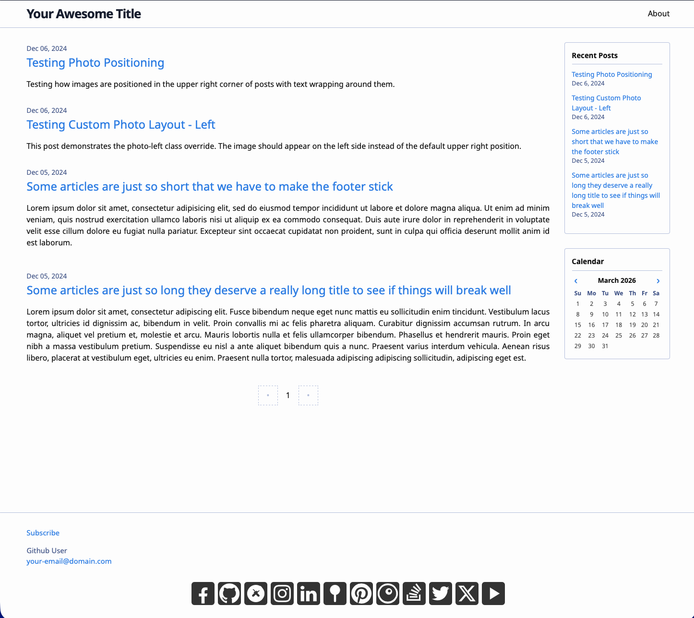
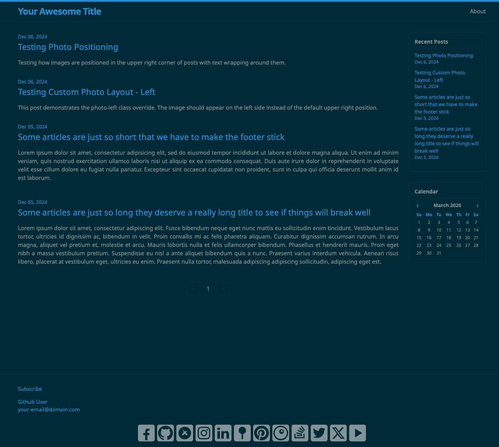
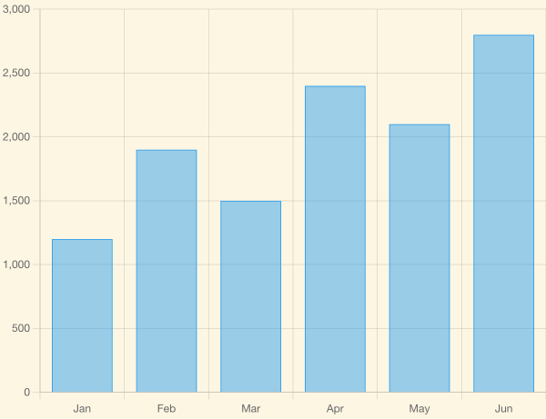
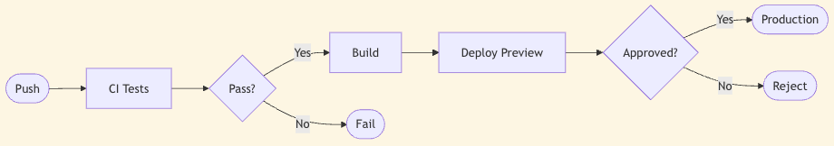

# Lord Stanley


A very much work-in-progress-but-one-day clean, responsive Jekyll theme. Inspired by the Minima theme but with enhanced features and improved structure.

Named after **[Frederick Stanley, 16th Earl of Derby](https://en.wikipedia.org/wiki/Frederick_Stanley,_16th_Earl_of_Derby)** (1841-1908), who served as Governor General of Canada and is best known for donating the Stanley Cup, the championship trophy of the National Hockey League.

## Screenshots

| Light | Dark |
|-------|------|
|  |  |

## Installation

Add this line to your Jekyll site's `Gemfile`:

```ruby
gem "jekyll-remote-theme"
```

And add these lines to your Jekyll site's `_config.yml`:

```yaml
plugins:
  - jekyll-remote-theme

remote_theme: jeffreyp/lord-stanley
```

Then execute:

```bash
bundle install
```

## Usage

### Basic Configuration

Update your `_config.yml` file with your site information:

```yaml
title: Your Site Title
author:
  name: Your Name
  email: your-email@domain.com

description: >
  Your site description for SEO and feed.xml

# SEO and site settings
url: "https://your-site.com"
baseurl: ""
lang: "en-US"
timezone: "America/New_York"

# Required plugins
plugins:
  - jekyll-feed
  - jekyll-seo-tag
  - jekyll-sitemap
  - jekyll-paginate
  - jekyll-archives

# Google Analytics (optional)
google_analytics: GA_MEASUREMENT_ID  # Replace with your Google Analytics 4 measurement ID

# Theme-specific settings
lord-stanley:
  skin: classic  # Options: classic, dark, auto, solarized-light, solarized-dark, solarized
  date_format: "%b %d, %Y"
  sidebar_recent_posts: 10  # Number of posts in the sidebar Recent Posts widget

  # Social links in footer
  social_links:
    - { platform: github, user_url: "https://github.com/yourusername" }
    - { platform: twitter, user_url: "https://twitter.com/yourusername" }
    - { platform: linkedin, user_url: "https://linkedin.com/in/yourusername" }

# Navigation pages
header_pages:
  - about.md
  - contact.md

# Show post excerpts on homepage
show_excerpts: true

# Pagination (requires jekyll-paginate)
paginate: 5
paginate_path: "/page:num/"

# Date archives (requires jekyll-archives)
jekyll-archives:
  enabled:
    - year
    - month
    - day
  layouts:
    year: archive
    month: archive
    day: archive
  permalinks:
    year: "/:year/"
    month: "/:year/:month/"
    day: "/:year/:month/:day/"
```

### Color Schemes

The theme includes several built-in color schemes:

- `classic` - Default light theme
- `dark` - Dark variant of the classic theme
- `auto` - Automatically switches between light and dark based on system preference
- `solarized-light` - Light solarized theme
- `solarized-dark` - Dark solarized theme
- `solarized` - Auto-switching solarized theme

### Social Media Links

Add social media links to your footer by configuring the `social_links` array in `_config.yml`. Supported platforms include:

- facebook
- github
- google_scholar
- instagram
- linkedin
- pinboard
- pinterest
- rss
- smugmug
- stackoverflow
- twitter
- x
- youtube

### Navigation

Configure which pages appear in your header navigation using the `header_pages` setting. Pages will appear in the order listed.

### Google Analytics

To enable Google Analytics tracking, add your measurement ID to `_config.yml`:

```yaml
google_analytics: G-XXXXXXXXXX  # Replace with your GA4 measurement ID
```

The theme includes:
- Privacy-respecting implementation that honors Do Not Track settings
- Automatic loading only in production environment
- Modern Google Analytics 4 support

### Charts and Diagrams

Posts can opt into Chart.js (data charts) and Mermaid (diagrams) by setting front matter flags. The libraries are loaded only on pages that need them.

| Chart.js | Mermaid |
|----------|---------|
|  |  |

#### Chart.js

Add `charts: true` to your post's front matter, then use a `<canvas>` element and inline `<script>` to initialize:

```markdown
---
layout: post
title: "My Data Post"
charts: true
---

<canvas id="my-chart" style="max-width: 600px;"></canvas>
<script>
new Chart(document.getElementById('my-chart'), {
  type: 'bar',
  data: {
    labels: ['Jan', 'Feb', 'Mar'],
    datasets: [{ label: 'Visitors', data: [1200, 1900, 1500] }]
  }
});
</script>
```

Supported chart types: `bar`, `line`, `pie`, `doughnut`, `radar`, `scatter`, `bubble`, and more. See the [Chart.js docs](https://www.chartjs.org/docs/latest/) for full options.

#### Mermaid Diagrams

Add `mermaid: true` to your post's front matter, then wrap diagram syntax in a `<div class="mermaid">` block:

```markdown
---
layout: post
title: "My Architecture Post"
mermaid: true
---

<div class="mermaid">
flowchart LR
  A[User] --> B[Server]
  B --> C[Database]
</div>
```

Supported diagram types include flowcharts, sequence diagrams, Gantt charts, class diagrams, pie charts, and more. See the [Mermaid docs](https://mermaid.js.org/intro/) for syntax.

Both flags can be combined in the same post:

```yaml
---
charts: true
mermaid: true
---
```

### Posts and Pages

Create posts in the `_posts` directory using the standard Jekyll naming convention:

```
_posts/YYYY-MM-DD-title.md
```

Create pages as Markdown files in your root directory or in subdirectories.

## Customization

### Overriding Theme Files

You can override any theme file by creating a file with the same name in your site's directory structure:

- `_layouts/` - Page layouts
- `_includes/` - Reusable components
- `_sass/` - Stylesheet partials
- `assets/` - CSS and other assets

### Custom Styles

Add custom CSS by creating `assets/styles.scss` in your site and importing the theme:

```scss
---
---

@import "lord-stanley";

// Your custom styles here
.custom-class {
  color: #your-color;
}
```

### Favicon

Replace the placeholder `favicon.ico` with your own favicon files:

- `favicon.ico` - Standard favicon
- `apple-touch-icon.png` - Apple touch icon (180x180)
- `favicon-32x32.png` - 32x32 favicon
- `favicon-16x16.png` - 16x16 favicon

## Development

To set up the development environment:

1. Clone the repository
2. Run `bundle install`
3. Run `bundle exec jekyll serve`
4. Open http://localhost:4000 in your browser

### File Structure

```
lord-stanley/
├── _includes/                    # Reusable components
│   ├── head.html                # HTML head section
│   ├── header.html              # Site header
│   ├── footer.html              # Site footer
│   ├── sidebar.html             # Sidebar (includes widgets below)
│   ├── sidebar-recent-posts.html # Recent posts widget
│   ├── sidebar-calendar.html    # Interactive calendar widget
│   └── social-icons/            # Social media icons
├── _layouts/                    # Page layouts
│   ├── base.html               # Base HTML structure
│   ├── home.html               # Homepage layout with pagination
│   ├── page.html               # Static page layout
│   ├── post.html               # Blog post layout
│   └── archive.html            # Date archive layout
├── _sass/                       # Stylesheet partials
│   └── lord-stanley/            # Theme styles
├── assets/                      # Compiled assets
└── _config.yml                  # Theme configuration
```

## Contributing

Bug reports and pull requests are welcome on GitHub at https://github.com/jeffreyp/lord-stanley.

## License

The theme is available as open source under the terms of the [MIT License](https://opensource.org/licenses/MIT).

## Credits

Originally inspired by the [Minima Jekyll theme](https://github.com/jekyll/minima). Built with modern Jekyll best practices and enhanced for better SEO and user experience.
